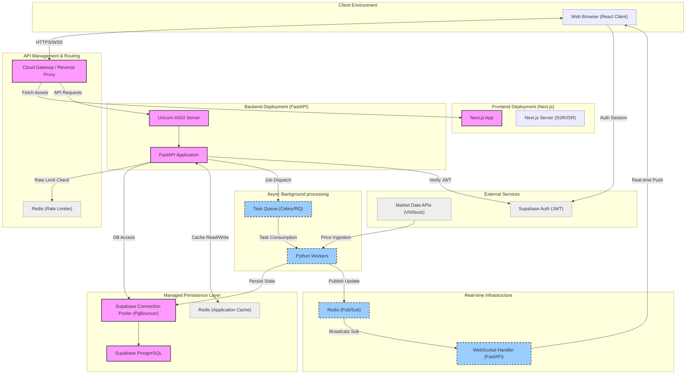
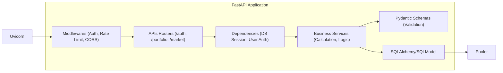
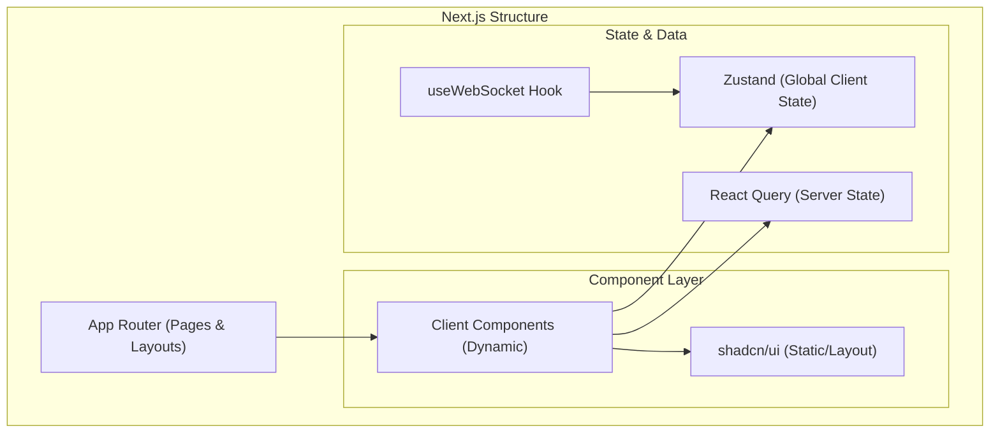
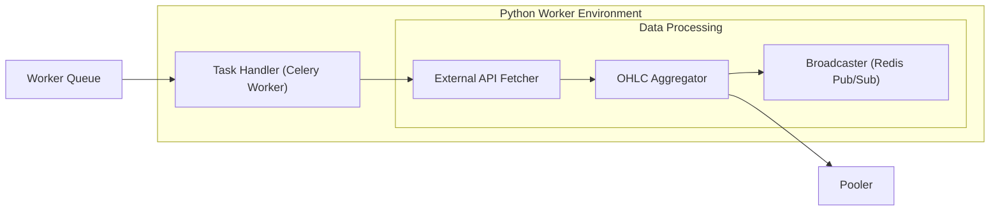

# Production Architecture: Investment Portfolio System (Refined)

This document outlines the detailed architecture for the investment portfolio management system, specifically tailored to the project's production environment.

## System Architecture Diagram

---

## Component Explanation

### 1. **Next.js Frontend (Separate Deployment)**
- **Role**: Client-side application and Server-Side Rendering (SSR).
- **Deployment**: Deployed as a standalone service (e.g., Vercel or independent container).
- **Function**: Manages UI state, handles user interactions, and initiates WebSocket connections for live data.

### 2. **FastAPI Backend (Served by Uvicorn)**
- **Runtime**: **Uvicorn ASGI Server** handles concurrency and manages the lifecycle of the FastAPI application.
- **FastAPI**: Manages RESTful endpoints, business logic for portfolio tracking, and integration with secondary services.

### 3. **Redis: Cache & Rate Limiting**
- **Rate Limiter**: Integrated into the API middleware to prevent abuse and manage external API quotas (e.g., limiting stock data requests per user).
- **Application Cache**: Stores transient data like market summaries and popular ticker metadata to minimize database round-trips.

### 4. **Supabase Connection Pooler (PgBouncer)**
- **Purpose**: Acts as a proxy between the Backend and PostgreSQL. It manages a "pool" of active connections to the database.
- **Benefit**: Essential for serverless or containerized environments where many short-lived connections can overwhelm the database's native connection limit.

### 5. **WebSocket Infrastructure**
- **Protocol**: `wss://` for secure live updates.
- **Flow**: Background workers ingest price data from **VNStock**, push it to **Redis Pub/Sub**, and the FastAPI WebSocket handler broadcasts it immediately to subscribed browsers.

---

## Internal Component Breakdown

### 1. FastAPI Backend Internals
The backend is structured for high modularity and async data handling.

### 2. Next.js Frontend Internals
The frontend uses a modern React architecture for state and real-time updates.

### 3. Background Worker & Data Pipeline
The engine that keeps market data fresh.

---

## Data Flow Explanation (Deep Dive)

### **The "Live Ticker" Pipeline (Asynchronous)**
1. **Sync Worker**: Periodically fetches prices from **External APIs**.
2. **Update Store**: Worker saves the new price to **Supabase** (via Pooler) for persistence.
3. **Notify Channel**: Worker publishes a JSON payload to a **Redis Channel** (e.g., `ticker:VNM`).
4. **Broadcast**: The **FastAPI WebSocket Server** (listening on that channel) pushes the message to all clients currently watching that ticker.

### **Authenticated API Request (Synchronous)**
1. **Gateway**: Passes the request + JWT header to **Uvicorn**.
2. **Rate Limit**: FastAPI checks **Redis** to see if the user has exceeded their request quota.
3. **Auth Check**: FastAPI verifies the **JWT** with **Supabase Auth**.
4. **Logic**: FastAPI executes business logic, fetching data via the **Supabase Pooler**.
5. **Response**: Result is returned through the Gateway to the Browser.
