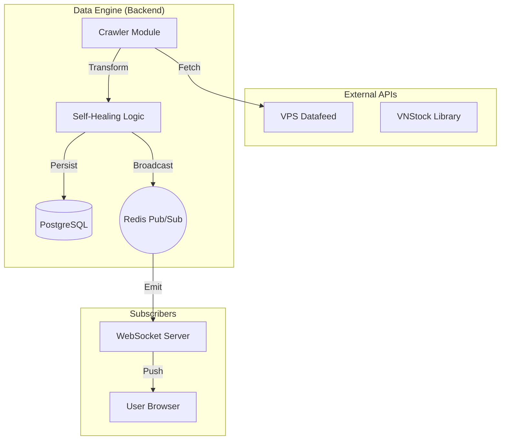

# 🏗️ System Architecture & Data Pipeline

Invest Journal is built on a modern, decoupled architecture designed for scale and real-time responsiveness.

## 🛠 Technology Stack

### Frontend
- **Framework**: Next.js 15+ (App Router)
- **Styling**: Tailwind CSS 4
- **State Management**: Zustand (Client state) & TanStack Query (Server state)
- **UI Components**: shadcn/ui
- **Real-time**: WebSockets for live price stream

### Backend
- **Language**: Python 3.11+
- **Framework**: FastAPI (Asynchronous)
- **Database**: PostgreSQL with SQLAlchemy ORM
- **Cache**: Redis (Rate limiting & Pub/Sub for WebSockets)
- **Task Runner**: Async background workers for market data ingestion

---

## 🛰 Real-time Data Pipeline (The Data Engine)

The core "brain" of Invest Journal is its **Data Engine**, which ensures price accuracy and system reliability.



### Key Technical Patterns:
1.  **Self-Healing**: The system automatically detects data gaps (e.g., during server downtime) and backfills missing historical prices upon restart.
2.  **Snapshot Tasks**: Hourly snapshots of portfolio value are calculated and stored to generate performance charts without heavy real-time computation.
3.  **Concurrency**: FastAPI's `asyncio` loop handles hundreds of concurrent user requests alongside the intensive market data crawler.

---

## 📂 Project Structure

```text
vn-stock-portfolio/
├── backend/            # Python Services
│   ├── adapters/       # External service interfaces (Market Data)
│   ├── core/           # Configuration & Security
│   ├── routers/        # API Endpoints (/portfolio, /market, etc.)
│   ├── services/       # Business logic (Profit/Loss calculation)
│   ├── tasks/          # Background worker definitions
│   └── models.py       # Database schema
├── frontend/           # Next.js Application
│   ├── app/            # Pages, Layouts & Server Components
│   ├── components/     # UI Building blocks
│   └── lib/            # Shared utilities & API client
└── docs/               # Project Documentation
```
